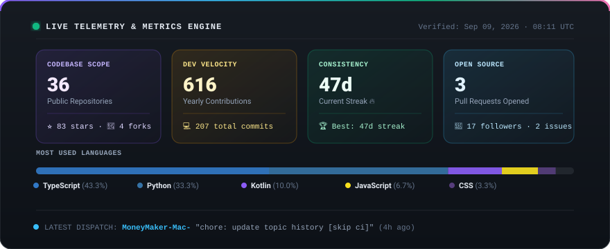

<div align="center">



</div>

<br/>

<div align="center">



</div>

<br/>

I build systems that run locally first. Computer vision, procedural graphics, and automation pipelines — all optimized for Apple Silicon before they touch the cloud.

---

### What I ship

**AgriSense AI** — Multi-agent crop disease detection. Gemini Vision for diagnosis, ChromaDB for retrieval, gTTS for voice output. Rebuilt from a hackathon prototype into production SaaS.

**analytics_shorts** — Procedural YouTube Shorts engine running on M3. Zero generative models. Pure programmatic vector graphics with daily `launchd` scheduling.

**RumiCam** — Real-time surveillance vision system. 

**IntelliCredit** — Five-service AI credit appraisal pipeline. Random Forest + SHAP explainability + Gemini Vision document extraction. Built for IITH × Vivriti Capital.

**courtroom-env** — Legal argumentation environment for multi-agent LLM reasoning. 0.9667 baseline on OpenEnv.

---

### How I build

```
AI / ML                     Full-Stack                  Automation
─────────────────────       ─────────────────────       ─────────────────────
PyTorch (MPS / Metal)       Next.js 14 (App Router)     macOS launchd
Gemini 2.0 Flash            FastAPI                     n8n workflows
ChromaDB                    Firebase                    Docker
OpenCV · DETR               PostgreSQL                  GitHub Actions
LangChain                   Tailwind CSS                Chrome Extensions
```

---

### Currently building

- [x] `analytics_shorts` — local procedural graphics engine
- [x] YouTube analytics + competitor research integration
- [x] Daily macOS `launchd` scheduler
- [ ] `shorts-factory` — CUDA → MPS port
- [ ] `shorts-factory` — Windows Task Scheduler → `launchd`

---

<sub>Dashboard updates daily via GitHub Actions. Data from GitHub GraphQL API. No third-party services.</sub>
