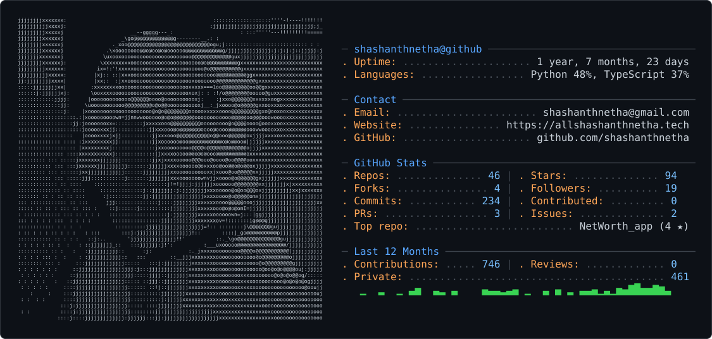

<picture>
  <source media="(prefers-color-scheme: dark)" srcset="dark_mode.svg" />
  <source media="(prefers-color-scheme: light)" srcset="light_mode.svg" />
  
</picture>

  

 

---

## 💡 ABOUT ME

I'm **Sha (Shashanth Netha)** — an **AI & Systems Engineer** passionate about **local-first AI inference**, **multi-agent architectures**, **computer vision**, and **high-performance automation**.

I specialize in taking AI systems from experimental research prototypes to production-grade, low-latency deployments. Most of my inference and procedural pipelines execute locally on **Apple Silicon M3 using MPS/Metal** before touching the cloud.

---

## ⚡ LIVE SYSTEM TELEMETRY

  ⚡ Telemetry metrics are automatically updated via GitHub Actions &amp; GraphQL API with zero third-party service dependencies.

 

---

## 🚀 FEATURED INNOVATIONS

<table width="100%">
  <tr>
    <td width="50%" valign="top">

### 🌾 AgriSense AI

**Multi-Agent Crop Disease Detection SaaS**

Rebuilt from a hackathon prototype into a full-stack production platform. Features **Gemini 2.0 Flash Vision** for multimodal leaf diagnosis, **ChromaDB RAG** with a 50+ disease knowledge base, and **gTTS** voice synthesis for local-language accessibility.

</td>

<td width="50%" valign="top">

### 🎬 analytics_shorts

**Local Procedural Video Generation Engine**

High-throughput YouTube Shorts generation pipeline running on **Apple Silicon M3**. Replaces slow generative AI video models with deterministic programmatic **SVG/Canvas vector graphics**, YouTube analytics integration, and daily `launchd` automation.

</td>
  </tr>

  <tr>
    <td width="50%" valign="top">

### 👁️ RumiCam

**Real-Time Vision Surveillance System**

Low-latency computer vision anomaly detection and video stream analytics platform. Implements **PyTorch spatial-temporal models** and **OpenCV object tracking** optimized for resource-constrained edge hardware.

</td>

<td width="50%" valign="top">

### 💳 IntelliCredit

**AI Credit Appraisal & Risk Scoring System**

Built for the **IITH × Vivriti Capital** challenge. Integrates **Gemini Vision OCR** document extraction, **Random Forest** credit scoring with **SHAP explainability**, and multi-stage decisioning workflows.

</td>
  </tr>

  <tr>
    <td colspan="2" valign="top">

### ⚖️ courtroom-env

**Legal Argumentation Benchmark Environment for Multi-Agent LLMs**

An **OpenEnv-compliant agentic sandbox** for testing multi-agent legal reasoning, evidence synthesis, and structured debate. Achieves a **0.9667 baseline accuracy** across benchmark scenarios.

</td>
  </tr>
</table>

 

---

## 🛠️ TECHNICAL ARSENAL

<table width="100%">
  <tr>
    <td width="25%" valign="top">

### 🧠 AI & ML

- PyTorch (MPS/Metal)
- Gemini 2.0 Flash / Vision
- ChromaDB Vector RAG
- LangChain Agents
- OpenCV · DETR · YOLO
- gTTS Speech Processing

</td>

<td width="25%" valign="top">

### 💻 Full-Stack Web

- Next.js 14
- React 18 & TypeScript
- FastAPI & Python 3.12
- Tailwind CSS
- Firebase Auth / Firestore
- REST & GraphQL APIs

</td>

<td width="25%" valign="top">

### ⚡ Systems & Automation

- Apple Silicon MPS Acceleration
- macOS `launchd`
- n8n Workflow Automation
- Docker & Containers
- GitHub Actions CI/CD
- Chrome Extensions (MV3)

</td>

<td width="25%" valign="top">

### 📊 Databases & Cloud

- PostgreSQL
- Redis Caching
- Cloud Firestore
- Vercel & Render
- Google Cloud Platform
- Git & Version Control

</td>
  </tr>
</table>

 

---

## 📈 GITHUB STATS & OVERVIEW

 

---

## 🎮 EASTER EGG

bored scrolling? play a round.

  

<a href="https://chromedino.com/" target="_blank">
  🦖 <strong>PLAY CHROME DINO</strong> 🦖
</a>

 

---

## 🤝 LET'S CONNECT & COLLABORATE

Whether you want to discuss multi-agent AI architectures,
local inference on Apple Silicon, or collaboration opportunities —
feel free to reach out!

  

Crafted with passion, local Python automation, &amp; Apple Silicon M3.

